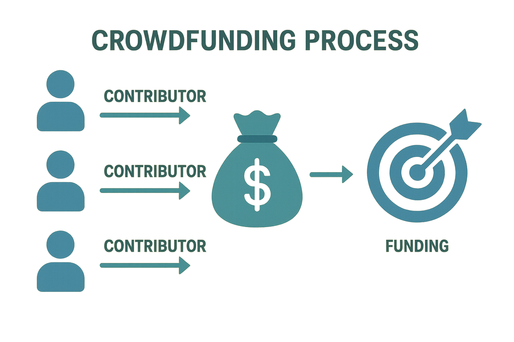
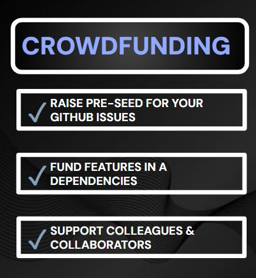

# Add Reward to an Existing Bounty

Crowdfunding on [Lightning Bounties](https://app.lightningbounties.com/) enables multiple people to pool Bitcoin (sats) into a single bounty reward. This transforms traditional single-sponsor bounties into community-driven funding efforts, making open-source development more collaborative and financially sustainable.


Crowdfunding Bounties In Action


### What is Bounty Crowdfunding? 

Bounty crowdfunding allows anyone to add Bitcoin rewards to existing GitHub issues, regardless of registration status or project ownership. Unlike traditional bounty systems where only one person funds an issue, Lightning Bounties enables [collaborative funding where multiple users can contribute sats to fund a single bounty](https://docs.lightningbounties.com/docs/glossary-work-in-progress/features)&#x20;

<figure><figcaption>
Crowdfunding process flow showing multiple contributors pooling Bitcoin for bounties.
</figcaption></figure>

***

### What is Crowdfunding on Lightning Bounties?

* **Multiple people can contribute sats (Bitcoin) to a single bounty.**
* **No registration required:** Anyone can add funds, even without a Lightning Bounties or GitHub account.
* **Microfunding:** Add as little or as much as you want.
* **Works for any GitHub issue:** You don’t need to be the project owner to post or fund a bounty.

***



### Why Crowdfund?

Crowdfunding enables:

* **Raise pre-seed for your GitHub issues**
* **Fund features in dependencies you rely on**
* **Support colleagues, friends, or open-source maintainers**

It democratizes funding, making it possible for anyone to support the projects they care about and help accelerate open-source progress.




<figure><figcaption>
Some of the few Benefits of Crowdfunding Bounties 
</figcaption></figure>




***

## How to Crowdfund a Bounty: Step-by-Step

***

#### 1. Visit[ app.lightningbounties.com](./#id-0.-visit-https-app.lightningbounties.com) & Click on Login with GitHub

<figure><figcaption>
Non-logged-in state on Lightning Bounties Platform
</figcaption></figure>

#### 2. Click on the Open Bounty You Wish to Add Funds Into

<figure><figcaption>
No Trophy Means It's Open to Add Rewards to
</figcaption></figure>

#### 3. You’ll see here that Sutt posted a bounty for the fastapi Repo, We are October Jackie and are going to add funds to this open bounty.

#### 4. Set the Amount of Sats you wish to add to the Open Bounty

#### 5. Optional: Click on Advanced settings

#### 6. Optional: Click on the Time Lock Dropdown Trigger and set duration of your bounty to be locked.

#### 7. Click on Add Reward

> _This button is available on every bounty, whether you’re logged in or not!_

<figure><figcaption>
This button is available on every open bounty, whether you’re logged in or not!
</figcaption></figure>

#### 8. Almost instantly you should see the "Reward added successfully" pop-up

<figure><figcaption>
Should See pop-up appear
</figcaption></figure>

#### 9. Scroll Down to the bottom of the Bounty & see those who crowdfunded.

<figure><figcaption>
Scroll to the Bottom of The Bounty to View Your Posted Rewards
</figcaption></figure>

## Adding Anonymous Rewards to a Bounty

***

#### 1. Find an open Bounty, Click on it then, Click on Add Reward To This Issue

<figure><figcaption>
You'l see this on every open bounty
</figcaption></figure>

#### 2. Set the Amount of Sats you wish to add to the Open Bounty

<figure><figcaption>
We will use 5 sats for this demo but you'll likely commit more rewards
</figcaption></figure>

#### 3. Click on Advanced settings

<figure><figcaption>
Critical step for posting anonymous rewards
</figcaption></figure>

#### 4. Optional: Click on the Time Lock Dropdown Trigger and set duration of your bounty to be locked.

<figure><figcaption>
Choose between minutes, hours, days, weeks, or months
</figcaption></figure>

#### 5. Click on Make reward anonymous

<figure><figcaption>
Must log-In with GitHub to use the bounty lock time feature.
</figcaption></figure>

#### 6. Click on Add Reward

> _This button is available on every bounty, whether you’re logged in or not!_

<figure><figcaption>
This button is available on every open bounty, whether you’re logged in or not!
</figcaption></figure>

#### 7. Almost instantly you should see the "Reward added successfully" pop-up

<figure><figcaption>
Should See This pop-up
</figcaption></figure>

#### 8. Scroll Down to the bottom of the Bounty & see those who crowdfunded.

<figure><figcaption>
Scroll to the Bottom of The Bounty
</figcaption></figure>

#### 9. Here, you see the Anonymous Reward You Just Posted

<figure><figcaption>
Should See Image Above
</figcaption></figure>

## Add Rewards to a Bounty without Login

***

#### 1. Visit[ https://app.lightningbounties.com](https://app.lightningbounties.com/) & <mark style="background-color:orange;">DO NOT Login With GitHub</mark>

<figure><figcaption>
Non-logged-in state on Lightning Bounties Platform
</figcaption></figure>

#### 2. Click on the Open Bounty You Wish to Add Fund to

#### 3. Enter the Amount & Generate a Lightning InvoiceEnter the amount of sats (Bitcoin) you want to contribute.

<figure><figcaption>
We'll use 6 sats for this demo but you'll likely commit more rewards
</figcaption></figure>

#### 4. Click on Add Reward

> _This button is available on every bounty, whether you’re logged in or not!_

<figure><figcaption>
This button is available on every open bounty, whether you’re logged in or not!
</figcaption></figure>

#### 5. A BOLT 11 Lightning invoice and QR code will appear.

### Pay the Invoice with Your Lightning Wallet

* Open your preferred [Lightning wallet](https://docs.lightningbounties.com/docs/resources/frequently-asked-questions/lightning-bounties-faqs#what-lightning-wallets-can-i-use) (Phoenix, Muun, Breez, Wallet of Satoshi, etc.).
* Scan the QR code or paste the invoice string.
* Confirm the payment

<figure><figcaption>
Screenshot showing generated Lightning invoice with QR code, BOLT-11 string, and payment details
</figcaption></figure>

#### 6. Your contribution is instantly added to the bounty’s reward pool! The bounty page updates in real time.

* In less than 60 seconds, you should see the "Payment received, reward added! successfully Refreshing in 5 secs..." pop-up

<figure><figcaption>
Should See This pop-up
</figcaption></figure>

#### 7. Scroll Down to the bottom of the Bounty & see those who crowdfunded.

Here, you see the Anonymous Reward You Just Posted

<figure><figcaption>
Scroll to the Bottom of The Bounty to See Your Posted Rewards
</figcaption></figure>

#### 8. No GitHub No Problem. Anyone can contribute to crowdfunding bounties and keep their anonymity

<figure><figcaption>
Non-logged-in state on Lightning Bounties Platform
</figcaption></figure>

***

### How It Works Under the Hood 

* **Anyone can contribute:** No need to log in or register.
* **Funds are pooled:** Every contribution increases the bounty’s total reward.
* **Bounty hunters are incentivized:** Higher rewards attract more developers to solve the issue.
* **Third-party bounties supported:** You can post and fund bounties on projects you don’t own.

For a video walkthrough, check out this [demo of Lightning Bounties crowdfunding](https://youtu.be/Elo8kxCfnr0?si=1O8gBY3YgS7xw7lj).

***

### Real-World Use Cases 

* **Kickstart new features:** Gather support for feature requests before development starts.
* **Fix critical bugs:** Rally the community to resolve high-impact issues.
* **Support dependencies:** Fund features or fixes in libraries your project depends on.
* **Show appreciation:** Pool funds to thank maintainers or contributors.

### &#x20;FAQ's

<strong>Do I need a Lightning Bounties account to crowdfund a bounty?</strong>

No! Anyone can contribute sats to any bounty using a Lightning wallet.

<strong>Can I crowdfund a bounty on a project I don’t own?</strong>

Yes! Lightning Bounties supports [third-party bounties](https://docs.lightningbounties.com/docs/glossary-work-in-progress/features#crowdfunding-bounties)

***

<figure><figcaption>
Bounty Flywheel
</figcaption></figure>

_Crowdfunding on Lightning Bounties turns every open-source user into a potential supporter. Pool your sats, fund the future, and help build the Bitcoin ecosystem—one bounty at a time!_
