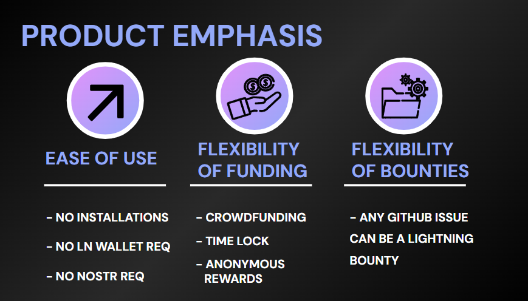
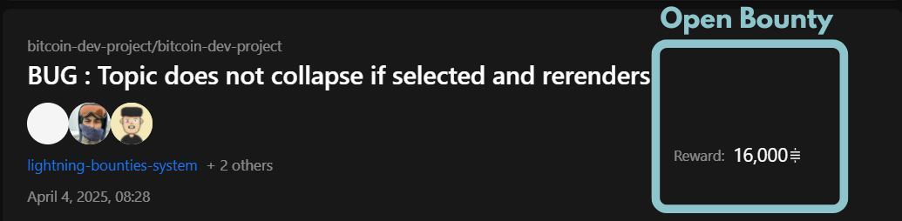
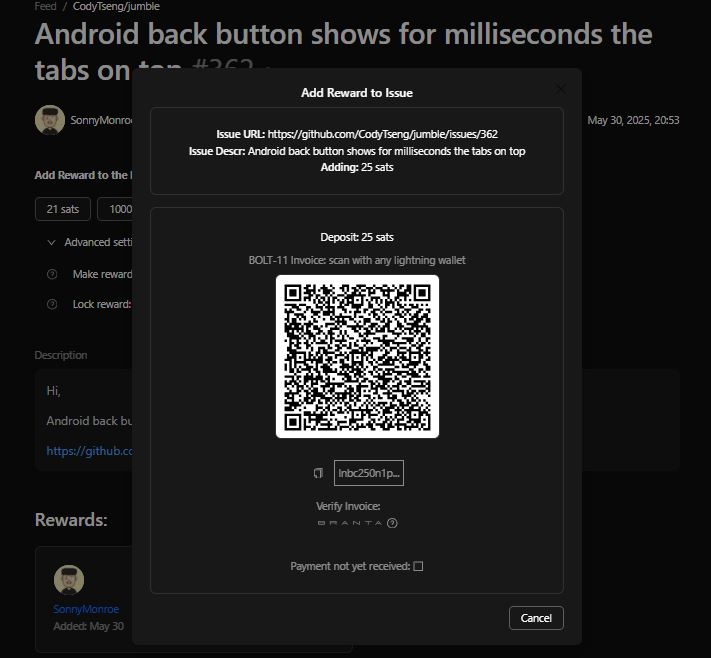

# Add Rewards to a Bounty without Login

Lightning Bounties' **no-login reward system** enables frictionless contributions to existing bounties, supporting the platform's goal of **minimal friction and maximum accessibility**. This feature allows anyone to instantly support open-source development without account creation barriers, embodying the principle that **it costs nothing to try**.

<figure><figcaption>
Lightning Bounties Product Emphasis
</figcaption></figure>

### System Architecture Benefits 



<h3 align="center">Minimal Friction Design</h3>

**Effortless setup through:**

* **No installations required** - no plugins or software downloads
* **No account creation** - immediate access to funding features
* **Familiar GitHub integration** - leverages existing developer workflows




<h3 align="center">Global Accessibility Features</h3>

**The no-login system supports:**

* **No banking restrictions** - bypasses region-locked payment processors
* **Democratized funding** - anyone can contribute regardless of location
* **Censorship resistance** - peer-to-peer Bitcoin transactions



<figure><figcaption>
Different Countries Contributing Without Barriers
</figcaption></figure> <figure><figcaption>
Bounty Flywheel
</figcaption></figure>

### Understanding No-Login Contributions 

The no-login system provides:

* **Instant access** to bounty funding without registration
* **Zero-friction contribution** process in under 30 seconds
* **Global accessibility** without banking restrictions
* **Privacy-first approach** for occasional contributors

This approach aligns with Lightning Bounties' core principle of **removing traditional barriers to open-source funding participation** while maintaining robust security

### Step-by-Step No-Login Process 


**No login required** - all bounties are visible to anonymous visitors




### **Visit** [**app.lightningbounties.com**](https://app.lightningbounties.com/) & <mark style="background-color:orange;">DO NOT Login With GitHub</mark>

<figure><figcaption>
Non-logged-in state on Lightning Bounties Platform
</figcaption></figure>



### **Browse the bounty feed** to find the issue you want to support


**Verify the bounty is still active** (no trophy icon indicates it's unsolved)


<figure><figcaption>
<strong>No</strong> ⛔<strong>"Trophy" icon:</strong> Bounty is open for you to solve.
</figcaption></figure> <figure><figcaption>
<strong>"Trophy"</strong> 🏆 <strong>icon present: Bounty is solved &#x26; claimed.</strong>
</figcaption></figure>




### Click on the open bounty you want to support

<figure><figcaption>
No Trophy Means It's Open to Add Rewards to
</figcaption></figure>



### Create Anonymous Reward

**Enter the amount** in sats you want to contribute to the open bounty

<figure><figcaption>
We'll use 5 sats for this demo but you'll likely commit more rewards
</figcaption></figure>



### :warning: No Lock-Expiry on One-Time Rewards :warning:

When creating an anonymous one-time additional reward: you can't set a lock time.

Since you are not logged-in, this reward will not be tied to an account and you will not be able to be able to expire this award and recover the funds. **Thus there is no lock time available for this reward action.**

If you want to be able expire this award, you can log-in and post the reward as anonymous.

<figure><figcaption>
Must log-In with GitHub to use the bounty lock time feature. 
</figcaption></figure>



### Click "Add Reward" - no authentication required

<figure><figcaption>
This button is available on every open bounty, whether you’re logged in or not!
</figcaption></figure>



### Implement [Branta Security Verification](https://brantaops.substack.com/p/lightning-bounties-secures-bolt-11)

**Essential security step**

1. **Click "Verify Invoice - Branta"** link below QR code
2. **New browser tab opens** to Branta's independent verification service
3. **Confirm green "Verified" status** appears
4. **Cross-check payment details**:
   * Amount matches your intended contribution
   * Recipient is Lightning Bounties
   * Memo corresponds to correct bounty

<figure><figcaption>
Screenshot showing generated Lightning invoice with QR code, BOLT-11 string, and payment details
</figcaption></figure>


**Why Branta verification matters**:

* **Prevents man-in-the-middle attacks** that could redirect payments
* **Provides independent confirmation** outside Lightning Bounties infrastructure
* **Protects against clipboard malware** and browser extension interference
* **Offers multi-device verification** capability for high-value contributions


<figure><figcaption>
✅ <strong>Address Verified</strong> ✅<strong>OK TO SEND FUNDS</strong> ✅
</figcaption></figure> <figure><figcaption>
⛔ <strong>Address Not Verified</strong> ⛔ <strong>DO NOT SEND FUNDS</strong> ⛔
</figcaption></figure>

_This__&#x20;__**optional yet highly-recommended safety check**__&#x20;__is especially critical for no-login users who lack account-based recovery options_



### Pay the Invoice with your Lightning Wallet&#x20;

A [BOLT 11 Lightning invoice ](https://www.whatisbitcoin.com/lightning-network/bolt-11-vs-bolt-12)and QR code will appear.

* Open your preferred [Lightning wallet](https://docs.lightningbounties.com/docs/resources/frequently-asked-questions/lightning-bounties-faqs#what-lightning-wallets-can-i-use) (Phoenix, Muun, Breez, Wallet of Satoshi, etc.).
* Scan the QR code or paste the invoice string.
* **Verify payment details** in your wallet interface
* **Confirm the payment**
* **Receive payment confirmation** in your wallet

<figure><figcaption>
Screenshot showing generated Lightning invoice with QR code, BOLT-11 string, and payment details
</figcaption></figure>



### Verify Contribution Success

1. **Return to bounty page** and refresh
2. **Confirm increased total reward** amount
3. **Verify contribution was processed** successfully
4. **Note updated bounty funding** for community awareness

The platform provides **real-time payment tracking** and **transparent reward systems**

<figure><figcaption>
Should See This pop-up
</figcaption></figure>

**See who contributed at the bottom**

<figure><figcaption>
Scroll to the Bottom of The Bounty
</figcaption></figure>

#### Your anonymous reward is now live!



<figure><figcaption>
Should See Image Above
</figcaption></figure>



***

### Summary 

The no-login reward system exemplifies Lightning Bounties' commitment to **frictionless, accessible, and innovative** open-source funding. By removing traditional barriers while maintaining robust security through **Branta verification**, this feature enables anyone to instantly support the open-source development they care about.

This approach creates a **global bounty aggregator** that truly democratizes software development funding, making it possible for anyone, anywhere to contribute to the projects that matter most.
