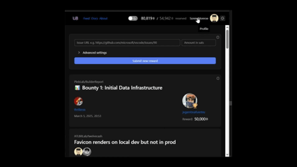
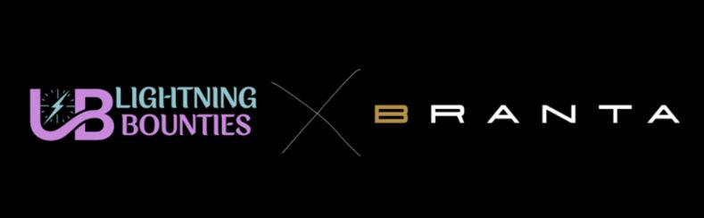

# Verify with Branta

<figure><figcaption>
Lightning Bounties contribution sequence
</figcaption></figure>

### What is [Branta](https://branta.pro/) Verification?

[**Verify with Branta** ](https://branta.pro/)is an optional security feature that lets you double-check a Lightning invoice before paying it on Lightning Bounties. When you see a "_**Verify Invoice - Branta**_" link under any payment form, clicking it opens a separate page that confirms the invoice destination is legitimate.

<figure><figcaption>
T<em>ypical Lightning Bounties payment form with the Branta verification link highlighted below the QR code</em>
</figcaption></figure>


**Why Branta verification matters**:

* **Prevents man-in-the-middle attacks** that could redirect payments
* **Provides independent confirmation** outside Lightning Bounties infrastructure
* **Protects against clipboard malware** and browser extension interference
* **Offers multi-device verification** capability for high-value contributions


### Where You'll Find Verification

You can use Branta verification in three ways on Lightning Bounties:

| Payment Method                 | Where to Find It                        |
| ------------------------------ | --------------------------------------- |
| **Account Deposits**           | Deposit modal when funding your account |
| **Adding Rewards (Logged In)** | Add Reward modal on bounty pages        |
| **Anonymous Contributions**    | Anonymous Add Reward flow               |

> For detailed steps on anonymous contributions, see our guide: [Add Rewards to a Bounty without Login](add-rewards-to-a-bounty-without-login.md)

### How to Verify an Invoice

#### Step 1: Generate Your Invoice

1. Complete your payment form (deposit, add reward, etc.)
2. Click "Generate Invoice" or similar button
3. Look for the QR code and invoice details

#### Step 2: Click Verify

1. Find the "Verify Invoice - Branta" link below the QR code
2. Click it - a new tab will open
3. Wait 1-2 seconds for verification to complete

<figure><figcaption>
✅ <strong>Address Verified</strong> ✅<strong>OK TO SEND FUNDS</strong> ✅
</figcaption></figure> <figure><figcaption>
⛔ <strong>Address Not Verified</strong> ⛔ <strong>DO NOT SEND FUNDS</strong> ⛔
</figcaption></figure>

_This__&#x20;__**optional yet highly-recommended safety check**__&#x20;__is especially critical for no-login users who lack account-based recovery options_

#### Step 3: Check the Results

* **Green "Verified"** = Safe to pay
* **Red warning** = DO NOT PAY - generate a new invoice

#### Step 4: Complete Payment

Return to Lightning Bounties and pay the invoice with your Lightning wallet.

### Example: Anonymous Reward Verification

Here's how verification works when adding rewards anonymously:

1. **Navigate to a bounty** on Lightning Bounties
2. **Click "Add Reward"** (no login required)
3. **Enter your amount** and generate the invoice
4. **Click "Verify Invoice - Branta"**
5. **Confirm green verification** before paying

<figure><figcaption></figcaption></figure>

> For the complete anonymous contribution process, see: [Adding Anonymous Rewards to a Bounty](adding-anonymous-rewards-to-a-bounty.md)

### Quick Security Comparison

| Without Verification    | With Verification          |
| ----------------------- | -------------------------- |
| Trust the website alone | Independent confirmation   |
| Single point of failure | Backup verification system |
| No tamper detection     | Alerts for fake invoices   |

### FAQ

<strong>Is verification required?</strong>

No, but it's strongly recommended for your security.

 <strong>Does Branta see my wallet or private keys?</strong>

Never. It only checks the public invoice string.

<strong>What if verification fails?</strong>

Don't pay! Generate a new invoice or [contact support.](https://discord.gg/zBxj4x4Cbq)

<strong>Can I verify on mobile?</strong>

Yes, works on any device with a browser.

### Related Guides

* [Add Rewards to a Bounty without Login](add-rewards-to-a-bounty-without-login.md)
* [Adding Anonymous Rewards to a Bounty](adding-anonymous-rewards-to-a-bounty.md)
* [Add Rewards to an Existing Bounty](./)

***

_Verify with Branta makes Lightning payments on Lightning Bounties safer without adding complexity to your workflow._

<figure><figcaption></figcaption></figure>
