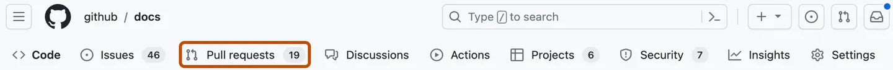
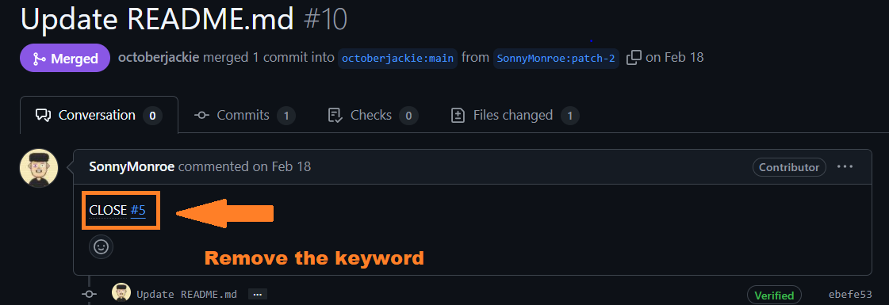
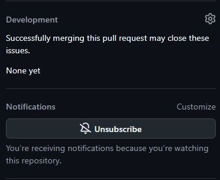

# Detach an Issues from Pull Requests

## How the Repo Maintainer can Detach an Issues from Pull Requests

In GitHub, issues and pull requests may automatically link when specific keywords (e.g., "close", "fixes") are used in pull request descriptions or comments. This guide explains how to detach an issue from a pull request.

### Steps to Detach an Issue from a Pull Request

1. **Navigate to the Pull Request** - Click on the **Pull Requests** tab and locate the pull request linked to the issue.

<figure><figcaption></figcaption></figure>

2. **Remove the Linking Keyword** - Open the pull request description or comments where the link to the issue is mentioned. - Look for keywords like `close #issue_number`, `fixes #issue_number`, or `resolves #issue_number`. - Remove these keywords or replace them with plain text (e.g., `related to #issue_number`).

<figure><figcaption></figcaption></figure>

3. **Update the Pull Request Description** - After editing the description or comments, click the **Save** or **Update** button to confirm your changes.

<figure><figcaption></figcaption></figure>

4. **Verify the Detachment** - Navigate to the issue that was previously linked. - Confirm that the issue is no longer listed under the **Linked pull requests** section.

<figure><figcaption>
Issue Linked (Before)
</figcaption></figure> <figure><figcaption>
Issue Detached (After)
</figcaption></figure>

***


Detaching  _the issue does not delete any comments or history.- Removing the linking keyword ensures that the issue and pull request are no longer automatically linked.- If the pull request has already been merged, the link cannot be removed._


### Lightning Bounties Considerations

* **Bounty Tracking:** Lightning Bounties tracks issue and PR status via GitHub integration. Unlinking an issue from a PR may affect bounty eligibility or payout triggers if the bounty is configured to require a linked/closed issue.
* **Workflow:** Always coordinate with your team and check Lightning Bounties [documentation ](https://docs.lightningbounties.com/docs)if you're unsure how unlinking affects bounty status.
* **Permissions:** Lightning Bounties only has read-only access to your repository and cannot modify links on your behalf.

***

### Best Practices

* Double-check PR descriptions for linking keywords before submitting.
* Communicate with contributors if unlinking may impact bounty rewards.
* For merged PRs, note that links are part of the permanent record; only open PRs can be edited to change links.
* For more details, refer to GitHub’s official [documentation ](https://docs.github.com/)on managing issues and pull requests.
* ### If you have additional questions, feel free to reach out to the repository maintainers or send a note to the [Lightning Bounties Discord](https://discord.gg/zBxj4x4Cbq)
