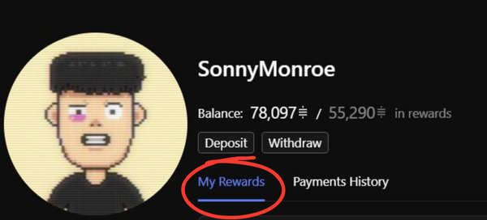
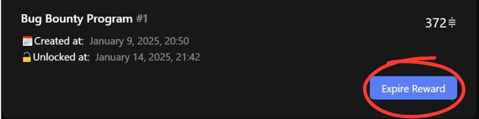

# Expire or Reclaim a Bounty Reward

### Overview

Expiring a bounty allows the creator to reclaim the reward if the issue remains unsolved after the lock time period. This process is secure and ensures that developers always have a guaranteed window to work on issues.


See [issue-lock-time.md](issue-lock-time.md "mention")For a more detailed Guide on this topic.&#x20;


***

### **Step-by-Step: Expiring a Bounty**

1. **Log In:**\
   Visit [app.lightningbounties.com](https://app.lightningbounties.com) and log in with your GitHub account.
2. **Navigate to Your Bounties:**\
   Go to your dashboard by clicking on your profile avatar _(Top Right)_&#x20;

<figure><figcaption>
<em>Click on Your Profile Avatar on the Top Right of Lightning Bounties Feed</em>
</figcaption></figure>

3. Once on Your dashboard select the "**My Rewards**" Tab.

<figure><figcaption>
<em>My Rewards Tab Should be By Default</em>
</figcaption></figure>

4. **Check Lock Time Status:**\
   Locate the bounty you wish to expire. Ensure the lock time period has ended. You will see an indicator or countdown showing when expiry is allowed.

<figure><figcaption>
<em>An unlocked bounty that can now be expired if needed.</em>
</figcaption></figure> <figure><figcaption>
<em>A locked bounty with remaining lock time displayed.</em>
</figcaption></figure>

5.  **Expire the Bounty:**

    Click the "**Expire Reward**" button next to your bounty.

<figure><figcaption>
<em>Expire Reward Shows Blue Coloring on Eligible Bounty</em>
</figcaption></figure>

6. **Reclaim Funds:**\
   The reward will be returned to your Lightning Bounties account balance, ready for withdrawal or use in other bounties.

***


**Note:** You cannot expire or reclaim a bounty before the lock time has ended.&#x20;

This is to protect developers who may be actively working on a solution


***

### **Frequently Asked Questions**

<strong>Can I extend or update the expiration on an unlocked bounty?</strong>

No, unlocked bounties remain posted until you manually expire them or a hunter claims the reward. To set a new lock time, add a new reward to the issue with your desired lock period, then expire the original unlocked reward.

<strong>What happens if I do nothing after the lock time expires?</strong>

The bounty remains active and visible to hunters.&#x20;

The only change is its status from :lock:"locked" to :unlock:"unlocked".

<strong>How do I know if my bounty is locked or unlocked?</strong>

Check the status label or emoji on your bounty in your dashboard or on the bounty detail page. Hover over the lock/unlock emoji to see the exact unlock date.

<strong>Why should I set a lock time for my bounty?</strong>

Lock time gives bounty hunters assurance that the reward will be available when they submit their work, encouraging more and better contributions.

<strong>Can I expire a reward posted without logging in?</strong>

No. Rewards posted via a one-time invoice in a non-logged-in state cannot be expired or reclaimed, as they are not linked to your account.

<strong>Can I expire an Anonymous reward?</strong>

Yes. Anonymous rewards can be expired using the same process as regular rewards.

