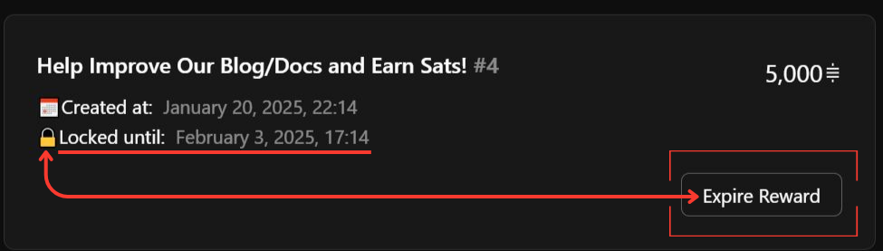
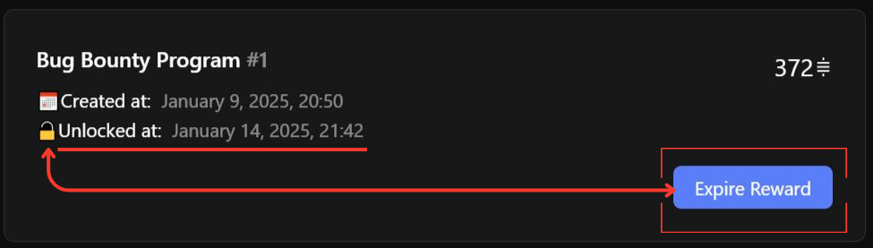

# Issue Lock Time

Bounties come along with a lock time, during which the escrow of the bounty reward is guaranteed.&#x20;

After the lock time is over, you may expire the reward which will automatically return the sats back to your wallet.&#x20;

* [See How to Expire or Reclaim your Bounty Here:](expire-or-reclaim-a-bounty-reward.md)


The reward does **NOT** automatically become revoked after the lock time is over.&#x20;

* That bounty can still be earned.&#x20;
* If a reward is unlocked, this simply means that that reward could be expire by the poster.


Lock time helps bounty hunters know the reward will be available by the time they submit their solution. But being able to expire rewards is necessary because sometimes you solve the issue yourself or your priorities for development change.

_We recommend two weeks as a standard lock time, to give your hunters time to submit a PR, but also a short enough time to iterate on your bounty postings and format._

### How to Add Lock Time When Posting a New Bounty

1. Go to [app.lightningbounties.com](https://app.lightningbounties.com/) and Log-In through GitHub
2. Copy/Paste the GitHub Issue URL and set the amount in Sats for the Bounty Reward
3. Click in the Advanced Settings Toggle
4.  Set the Lock Reward Time in either&#x20;

    1. Minutes&#x20;
    2. Hours&#x20;
    3. Days
    4. Weeks
    5. Months&#x20;

    _We recommend two weeks as a standard lock time, to give your hunters time to submit a PR, but also a short enough time to iterate on your bounty postings and format._
5. Click on "Submit New Reward"

<figure><figcaption>
<strong>Time Lock in Advanced Settings</strong> 🔝
</figcaption></figure>

### **Understanding Bounty Status: Locked vs. Unlocked**

#### :lock: **Locked Bounties**

* **Definition:**\
  A bounty is _locked_ when its reward is held in escrow for a specific lock time, guaranteeing availability to bounty hunters.
* **How it works:**
  * The lock time is set when you post a bounty (e.g., two weeks is recommended).
  * During this period, the reward cannot be expired or reclaimed by the bounty poster.
  * Bounty hunters can work on the issue with confidence that the reward is guaranteed if they submit a valid solution within the lock window.
* **Visibility:**
  * The remaining lock time is displayed on the bounty detail page and in your dashboard.
  * A lock emoji or label indicates the bounty is currently locked.
* **Best Practice:**
  * Two weeks is suggested as a standard lock time, balancing developer opportunity and bounty iteration.

<figure><figcaption>
<em>A locked bounty with remaining lock time displayed.</em>
</figcaption></figure>

***

#### :unlock: **Unlocked Bounties**

* **Definition:**\
  A bounty becomes _unlocked_ when the lock time expires.
* **What changes:**
  * The poster can now manually expire the reward and reclaim their sats if needed.
  * The bounty remains open and visible to hunters until it is solved or you take action.
  * The reward is not automatically revoked; it is still claimable by bounty hunters until you expire it.
* **Visibility:**
  * Unlocked bounties are labeled as such in your dashboard, and an "Expire Reward" button appears.
  * An unlock emoji or label indicates the bounty is now eligible for expiry.

<figure><figcaption>
<em>An unlocked bounty that can now be expired if needed.</em>
</figcaption></figure>

***

### **How Lock Time & Expiry Protects Hunters and Posters**

* **Guaranteed Escrow:**\
  Lock time ensures bounty rewards are available for a set period, giving hunters confidence to submit solutions.
* **Flexible Expiry:**\
  After the lock time, posters can reclaim funds if the issue is solved elsewhere or priorities change.
* **Manual Control:**\
  Bounties do not expire automatically. You must take action to expire and reclaim your sats after the lock time ends.

***

### **Frequently Asked Questions**

<strong>Can I extend or update the expiration on an unlocked bounty?</strong>

No, unlocked bounties remain posted until you manually expire them or a hunter claims the reward. To set a new lock time, add a new reward to the issue with your desired lock period, then expire the original unlocked reward.

<strong>What happens if I do nothing after the lock time expires?</strong>

The bounty remains active and visible to hunters.&#x20;

The only change is its status from :lock:"locked" to :unlock:"unlocked".

<strong>How do I know if my bounty is locked or unlocked?</strong>

Check the status label or emoji on your bounty in your dashboard or on the bounty detail page. Hover over the lock/unlock emoji to see the exact unlock date.

<strong>Why should I set a lock time for my bounty?</strong>

Lock time gives bounty hunters assurance that the reward will be available when they submit their work, encouraging more and better contributions.

<strong>Can I expire a reward posted without logging in?</strong>

No. Rewards posted via a one-time invoice in a non-logged-in state cannot be expired or reclaimed, as they are not linked to your account.

<strong>Can I expire an Anonymous reward?</strong>

Yes. Anonymous rewards can be expired using the same process as regular rewards.

