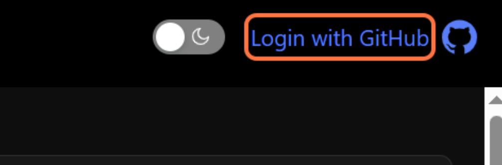
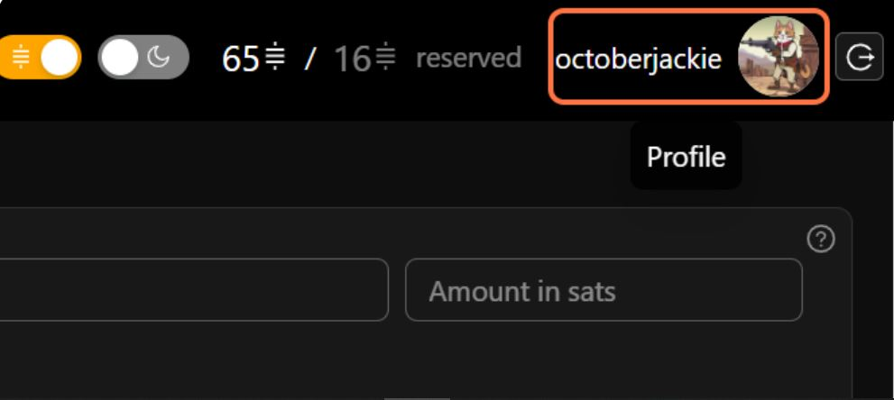
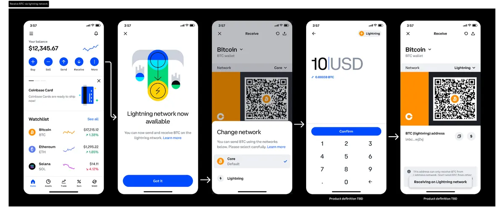
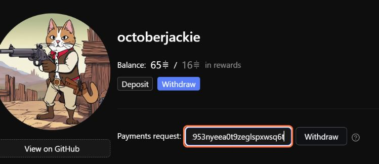
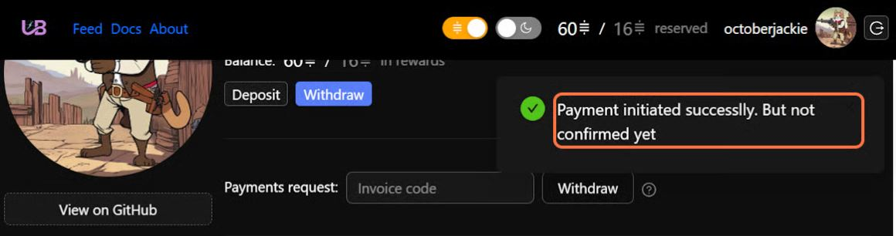
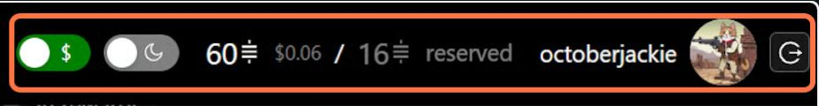
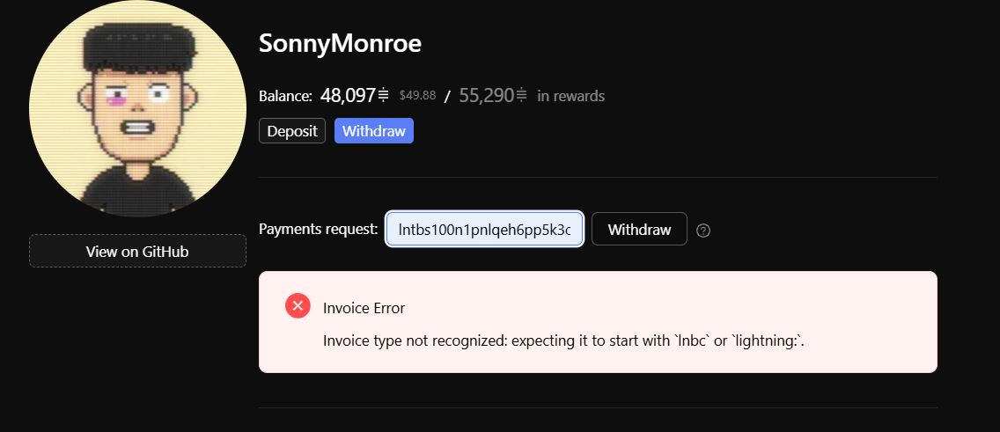

# Withdrawing Funds

### Overview

This guide will walk you through the process of withdrawing your earned Bitcoin rewards from your Lightning Bounties account to your personal Lightning wallet using Lightning Network invoices. The process is straightforward, quick, and allows you to access your bounty rewards within seconds.

### Prerequisites

Before you begin the withdrawal process, make sure you have:

* Successfully claimed at least one bounty reward
* A Lightning Network compatible wallet (such as [Coinbase](https://www.coinbase.com/), [Breez](https://breez.technology/mobile/), [Phoenix](https://phoenix.acinq.co/), or [Muun](https://muun.com/))

<figure><figcaption></figcaption></figure>

* A non-zero balance in your Lightning Bounties account
  * We recommend keeping approximately 2% of your total withdrawal amount in your Lightning Bounties account to cover Lightning Network transaction fees.

<figure><figcaption></figcaption></figure>

***

## Step-by-Step Withdrawal Process

### 1. Access Lightning Bounties Platform

* Visit [app.lightningbounties.com](https://app.lightningbounties.com)
* Click on "**Login with GitHub**" in the top right corner

<figure><figcaption></figcaption></figure>

### 2. Navigate to Withdrawal Page

* Click on your profile avatar in the top right corner

<figure><figcaption></figcaption></figure>

* Click on the "Withdraw" Button

<figure><figcaption></figcaption></figure>

### 3. Generate a Lightning Invoice in Your Wallet

* You'll need to generate a Lightning invoice from your wallet of choice.&#x20;
  * _We covered Coinbase specifically in a detailed section_ [_here_](https://docs.lightningbounties.com/docs/getting-started/solving-a-bounty/how-to-convert-sats-into-local-currencies)

<figure><figcaption>
Screenshots of Lightning invoice generation from the Coinbase app
</figcaption></figure>

### 4. Complete the Withdrawal on Lightning Bounties

* Paste your Lightning invoice into the input field

<figure><figcaption></figcaption></figure>

* Review the "Decoded Invoice" information that appears

<figure><figcaption></figcaption></figure>

* Click the "**Withdraw**" button to initiate the payment

<figure><figcaption></figcaption></figure>

### 5. Monitor Payment Status

* You'll see a "**Payment initiated successfully. But not confirmed yet"** notification
* The system will process your payment, which typically completes within seconds
* Check your Lightning wallet to confirm receipt of funds

<figure><figcaption></figcaption></figure>

### Balance Display Features

Lightning Bounties provides flexible ways to view your balance:

* **Toggle between Sats and Fiat**: Click on your displayed toggle and shows balance (e.g., 60 sats & "0.06") to switch between sats and USD display formats
* **Reserved Funds Display**: The platform shows any funds that are currently reserved for bounties  that you posted and are not yet solved.&#x20;

<figure><figcaption></figcaption></figure>

### Invoice Decoder Feature

When you paste a Lightning invoice, our built-in decoder automatically:

* Verifies the invoice is valid
* Extracts and displays the:
  * Payment amount in sats
  * Expiry time
  * Memo or Payment description (if included)
  * Destination Hash
* Alerts you to any potential issues before completing the withdrawal

<figure><figcaption>
✔️<strong>Correct</strong>✔️
</figcaption></figure> <figure><figcaption>
❌<strong>Incorrect</strong>❌
</figcaption></figure>

***

### Important Notes

* **No minimum withdrawal**: Lightning Bounties doesn't enforce a minimum withdrawal amount
* **Fee recommendation**: Keep approximately 2% of your withdrawal amount in your account to cover Lightning Network routing fees
* **Processing time**: Most withdrawals are processed instantly, but may occasionally take up to 5 minutes during high network activity
* **Invoice expiration**: Lightning invoices typically expire after a set period (usually 60 minutes to 24 hours, depending on your wallet)

### Troubleshooting

#### Common Issues and Solutions

| Issue                                          | Solution                                                                                                |
| ---------------------------------------------- | ------------------------------------------------------------------------------------------------------- |
| "Invalid invoice" error                        | Check that you've copied the entire invoice string correctly and that it hasn't expired                 |
| Payment shows as "initiated but not confirmed" | The Lightning Network might be experiencing congestion - wait a few minutes and check your wallet       |
| Routing failures                               | Lightning Network routing issues can occur - try generating a new invoice or try again in a few minutes |
| Transaction fees too high                      | Keep approximately 2% of your total amount in your account to cover routing fees                        |

<figure><figcaption>
✔️<strong>Correct</strong>✔️
</figcaption></figure> <figure><figcaption>
❌<strong>Incorrect</strong>❌
</figcaption></figure>

***

**Need more help?** Join our [Discord community](https://discord.gg/zBxj4x4Cbq) for assistance with withdrawals or any other Lightning Bounties features.
