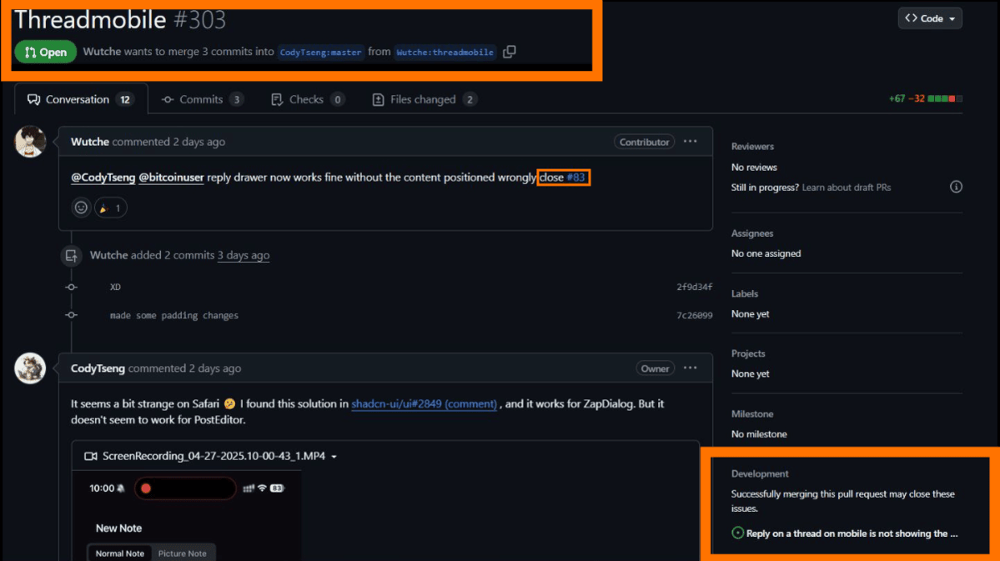
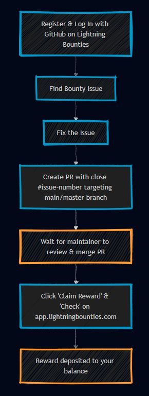

# Claim Reward Criteria & Troubleshooting Guide

## Claim Reward Criteria

To successfully claim a reward for a bounty, follow these steps:

### 1. **Register and Log In with GitHub**


### :warning: VERY Important :warning:

It’s essential to register and log in to Lightning Bounties using your GitHub account **before** submitting your PR and clicking _**"Claim Reward."**_&#x20;

* This ensures your reward is properly linked to your account and that you’re eligible to claim the bounty.
  * _See_ [first-time-onboarding](../first-time-onboarding/ "mention") _For Detailed Instructions._&#x20;


### 2. Find an Issue

* Browse available bounties on the [app.lightningbounties.com](http://app.lightningbounties.com/) feed
* Review the issue details, requirements, and reward amount
* Check if the bounty is still available (not claimed by someone else)
  * _See_ [looking-for-a-project-to-get-rewarded.md](looking-for-a-project-to-get-rewarded.md "mention") _For Detailed Instructions._

### 3. Fix the Issue

* Fork the repository to your GitHub account
* Clone your fork locally and create a branch for your work
* Implement the fix according to the issue requirements
* Test your changes thoroughly to ensure they meet all acceptance criteria
* Push your changes to your fork
  * &#x20;_See_ [working-on-the-bounty.md](working-on-the-bounty.md "mention") _For Detailed Instructions._&#x20;

### 4.  Create a Pull Request (PR) **Targeting Main/Master**

* Go to the original repository on GitHub.
* Click "Compare & pull request" for your branch.


:warning: **CRITICAL STEP** :warning:

In the PR description, include `close #issue-number` or `closes #issue-number` to link the PR to the issue.


> ## :information\_source: **Why?**
>
> <mark style="background-color:orange;">GitHub only recognizes linked issues when the PR targets the repository's default branch (usually main or master).</mark>&#x20;
>
> * [Learn more about linking PRs to issues.](https://docs.github.com/en/issues/tracking-your-work-with-issues/using-issues/linking-a-pull-request-to-an-issue#linking-a-pull-request-to-an-issue-using-a-keyword)

* Provide a clear explanation of your changes and how they address the issue.
* You can include as much additional information as needed in your PR description.
* Submit the PR for review

#### PR Requirements Checklist

Before you request review, verify all items below:

- PR targets the repo default branch (`main` or `master`)
- PR body includes `close #issue-number` or `closes #issue-number`
- PR body references the Lightning Bounties issue URL
- PR contains real code/docs changes (not an empty PR)
- PR passes repository checks (CI/tests/lint if required by that repo)
- PR is not in draft state
- PR uses the same GitHub account connected to your Lightning Bounties account
- PR stays focused on the bounty scope and acceptance criteria


Tip: If maintainers require a specific template, fill every required section in the PR form so review is not blocked.


**Screenshot Example:**

<figure><figcaption><p>Example: PR description with correct close syntax and branch targeting.</p></figcaption></figure>


:information\_source: **INFO** :information\_source:

_**You may need to refresh the GitHub page to see the issue show up as linked.**_


### 5. **Wait for Maintainer to Merge the PR**

* The repository maintainer will review your PR.&#x20;
  * Once it is approved and merged, the issue will be closed automatically if you used the correct `close`syntax.
    * &#x20;_See_ [working-on-the-bounty.md](working-on-the-bounty.md "mention") _For Detailed Instructions._&#x20;

### 6. Claim Reward Process

* **Manually claim your reward:**
  * Visit [app.lightningbounties.com](http://app.lightningbounties.com/) and find the Bounty you solved
  * Click the "_**Claim Reward**_" button
  * Click the "_**Check**_" button to verify your eligibility


:warning:**IMPORTANT**:warning:

The reward process will not start automatically.&#x20;

You must manually complete the claim steps on [app.lightningbounties.com](http://app.lightningbounties.com/) after your PR is merged.


<figure><figcaption><p>Claim Reward &#x26; Check Interface on <a href="https://app.lightningbounties.com/">app.lightningbounties.com</a></p></figcaption></figure>


### :checkered\_flag:Complete :checkered\_flag:

**Once your PR is merged and your eligibility is verified, the reward will be deposited directly into your Lightning Bounties balance.**


***

### Complete Claim Process Visualization



<div data-full-width="false"><figure><figcaption><p>Complete Claim Process</p></figcaption></figure></div>



<figure><figcaption><p>Simplified Workflow</p></figcaption></figure>



***

## Troubleshooting

If you encounter issues claiming your Lightning Bounty reward, use this guide to diagnose and resolve common problems.&#x20;

For more details, see the [Lightning Bounties Troubleshooting Guide](https://docs.lightningbounties.com/docs/getting-started/solving-a-bounty/claim-reward-criteria-and-troubleshooting-guide) and [GitHub’s official documentation on linking pull requests to issues](https://docs.github.com/en/issues/tracking-your-work-with-issues/using-issues/linking-a-pull-request-to-an-issue#linking-a-pull-request-to-an-issue-using-a-keyword).

### Quick Checklist: Claim Reward Not Working

Run this quick check in order before requesting support:

1. Confirm PR is merged into `main`/`master` (not just approved).
2. Confirm PR body includes `close #issue-number` with the correct issue number.
3. Confirm the GitHub issue is now closed.
4. Confirm you clicked **Claim Reward** and then **Check** in the app.
5. Refresh the page and re-run **Check** after a short delay.
6. Confirm you are logged into Lightning Bounties with the same GitHub identity used for the PR.
7. If still blocked, post the issue + PR links in Discord and request an override.

***

### Issue Not Linked to PR

<div data-full-width="false"><figure><figcaption><p> <em>Example: PR without the required "close #issue-number" syntax</em></p></figcaption></figure></div>

**Problem Indicators:**

* The PR does not show the linked issue in the GitHub interface.
* The issue remains open after your PR is merged.
* The reward does not process automatically.

## **Solutions:**

### **1. Edit PR Description**

If your PR is still open, you can update the PR description to add the correct closing keyword (e.g., `close #issue-number`).

* Navigate to your pull request on GitHub.
* Near the top of the PR page, locate the description section (below the title).
* Hover over the description area and click the "Edit" (... or pencil) icon.
* Add the `close #issue-number`keyword at the **top of the PR description** _(not in a comment or commit message, as only the PR body triggers the automation for Lightning Bounties and GitHub)_.


What the Workflow Looks Like


### **2. Ask Repository Owner (If you can't edit the PR)**

* Contact the repository owner or maintainer
* Ask them to edit the PR description to add the closing keyword

### **3. Create a Follow-up PR** (If original PR was already merged)

If your original PR has already been merged without the correct closing keyword:  [(see below)](claim-reward-criteria-and-troubleshooting-guide.md#example-of-a-follow-up-pr-created-to-properly-link-the-issue-for-lightning-bounty-payment)

* Create a new PR with a minimal change (e.g., update documentation, add a comment, or fix a typo).
* In the PR description, include the appropriate closing keyword (e.g., `close #42`).
*   Reference your original PR:

    
    ```markdown
    close #42  
    This PR references the work completed in #123 (original PR).
    ```
    
* Notify the repository owner about this follow-up PR and explain its purpose.
* Once merged, return to Lightning Bounties and click "Claim Reward" and "Check."

#### Example of a follow-up PR created to properly link the issue for Lightning Bounty payment :arrow\_down\_small:

<figure><figcaption><p><em>Example: A minimal follow-up PR correctly referencing both the issue and original  PR</em></p></figcaption></figure>

### **4. Request an Override via Discord**

If you are unable to resolve the issue through the above steps, join the [Lightning Bounties Discord](https://discord.gg/zBxj4x4Cbq) and request an override from the LB team.

* Add a comment to the PR, tagging the maintainer (e.g., `@maintainer`) and include the Lightning Bounties issue URL.
* Ask the maintainer to respond in the PR thread confirming that the PR qualifies for the bounty.


## :warning:Important :warning:

The maintainer must write a clear comment confirming the qualification (an emoji or reaction is not sufficient as proof).


For more details on linking PRs to issues, see [GitHub’s guide on linking pull requests to issues](https://docs.github.com/en/issues/tracking-your-work-with-issues/using-issues/linking-a-pull-request-to-an-issue-using-a-keyword).

#### Payment Not Received

**Verification Steps:**

1. Confirm the issue is marked as "closed" on GitHub
2. Verify the PR that closed it has been merged
3. Check that you clicked "Claim Reward" on Lightning Bounties

**Solutions:**

* **Check User Balance**: Ensure your account balance is updated on [app.lightningbounties.com](http://app.lightningbounties.com/)
* **Verify Wallet Setup**: Make sure your Lightning Network wallet is correctly configured
* **Contact Support**: If issues persist, reach out to the Lightning Bounties [Discord](https://discord.gg/zBxj4x4Cbq) for assistance

#### Common Errors and Solutions

| Error                 | Description                              | Solution                                      |
| --------------------- | ---------------------------------------- | --------------------------------------------- |
| Missing link syntax   | PR doesn't include `close #issue-number` | Edit PR description or create follow-up PR    |
| Wrong issue number    | PR references incorrect issue            | Edit PR or create new PR with correct number  |
| Not claiming reward   | Forgot to click "Claim Reward" button    | Go to Lightning Bounties app and click button |
| Issue already claimed | Another dev claimed the bounty first     | Check issue status before working on it       |

### Best Practices

* **Always double-check** the issue number when adding `close #issue-number` syntax
* **Communicate clearly** with repository maintainers about your bounty claim
* **Keep PRs focused** on addressing the specific issue
* **Don't forget** to manually click "Claim Reward" on Lightning Bounties platform

***


## :information\_source: Remember :information\_source:

The Lightning Bounties system requires both proper GitHub issue linking through the `close #issue-number` syntax **AND** manual claiming through the Lightning Bounties platform.&#x20;

_Both steps are essential for successful reward processing_


For additional assistance, join the Lightning Bounties [Discord](https://discord.gg/zBxj4x4Cbq) community.
