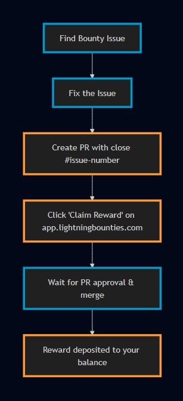
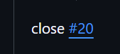
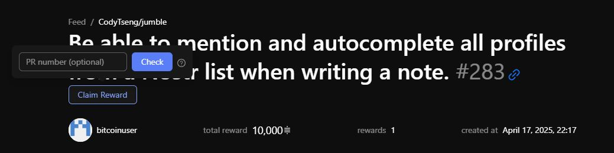
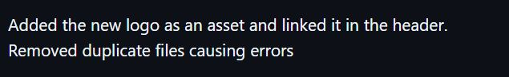
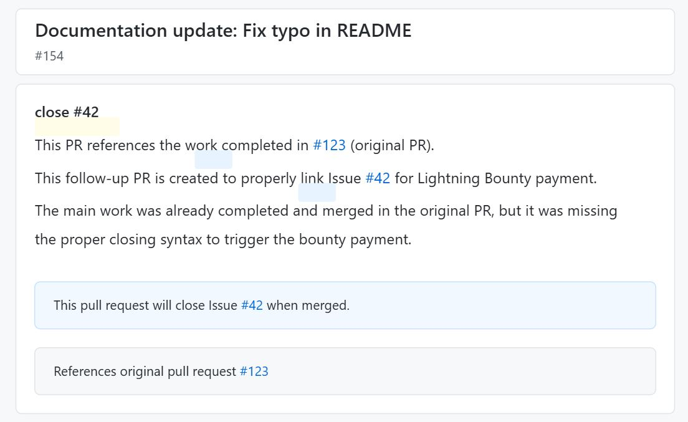

# Claim Reward Criteria & Troubleshooting Guide

## Introduction

This guide outlines the complete process for claiming rewards and provides troubleshooting steps for developers working on bounties on the Lightning Bounties Platform.

<figure><figcaption></figcaption></figure>

### ClaimReward Criteria

To successfully claim a reward for a bounty, follow these steps:

#### 1. Find an Issue

* Browse available bounties on the [app.lightningbounties.com](http://app.lightningbounties.com/) feed
* Review the issue details, requirements, and reward amount
* Check if the bounty is still available (not claimed by someone else)

#### 2. Fix the Issue

* Fork the repository to your GitHub account
* Clone your fork locally and create a branch for your work
* Implement the fix according to the issue requirements
* Test your changes thoroughly to ensure they meet all acceptance criteria
* Push your changes to your fork

#### 3. Create a Pull Request (PR)

<div data-full-width="true"><figure><figcaption><p> <em>Example: a PR with the correct "close #issue-number" syntax highlighted</em></p></figcaption></figure></div>

* Go to the original repository on GitHub
* Click "Compare & pull request" for your branch
* **CRITICAL STEP**: In the PR description, include `close #issue-number` or `closes #issue-number` to link the PR to the issue
* Provide a clear explanation of your changes and how they address the issue
* Submit the PR for review

#### 4. Claim Reward Process

1. **Wait for the repository maintainer to review and merge your PR.**
2.  **Manually claim your reward:**

    * Visit [app.lightningbounties.com](http://app.lightningbounties.com/)
    * Click the "Claim Reward" button
    * Click the "Check" button to verify your eligibility

    <figure><figcaption><p>Claim Reward &#x26; Check Interface on <a href="https://app.lightningbounties.com/">app.lightningbounties.com</a></p></figcaption></figure>
3. **Once your PR is merged and your eligibility is verified, the reward will be deposited directly into your Lightning Bounties balance.**

⚠️ **IMPORTANT**: The reward process will not start automatically. You must manually complete the claim steps on [app.lightningbounties.com](http://app.lightningbounties.com/) after your PR is merged.

### Complete Claim Process Visualization

<figure><figcaption></figcaption></figure>

### Troubleshooting

#### Issue Not Linked to PR

<div data-full-width="false"><figure><figcaption><p> <em>Example: PR without the required "close #issue-number" syntax</em></p></figcaption></figure></div>

**Problem Indicators:**

* PR doesn't show linked issue in GitHub interface
* The issue remains open after PR is merged
* Reward doesn't process automatically

**Solutions:**

* **Edit PR Description**: If the PR is still open, edit it to add `close #issue-number` syntax
* **Ask Repository Owner**: If you cannot edit the PR, ask the repository owner to add the link for you
* **Create Follow-up PR**: If the PR was already merged, create a minimal follow-up PR (see below)

#### PR Merged but No Payment

<figure><figcaption><p><em>Example: A minimal follow-up PR correctly referencing both the issue and original</em> </p></figcaption></figure>

If your PR was merged but did not have the proper linking syntax:

1. Create a new PR with minimal changes:
   * Update documentation
   * Add a comment
   * Fix a typo
2.  In the PR description, include:

    
    ```markdown
    close #42 This PR references the work completed in #123 (original PR).

    This follow-up PR is created to properly link the issue for Lightning Bounty payment.
    ```
    
3. Notify the repository owner about this follow-up PR and explain its purpose
4. Once merged, go to Lightning Bounties and click "Claim Reward" and "Check"

#### Payment Not Received

**Verification Steps:**

1. Confirm the issue is marked as "closed" on GitHub
2. Verify the PR that closed it has been merged
3. Check that you clicked "Claim Reward" on Lightning Bounties
4. Allow up to 24 hours for processing in some cases

**Solutions:**

* **Check User Balance**: Ensure your account balance is updated on [app.lightningbounties.com](http://app.lightningbounties.com/)
* **Verify Wallet Setup**: Make sure your Lightning Network wallet is correctly configured
* **Contact Support**: If issues persist, reach out to the Lightning Bounties [Discord](https://discord.gg/zBxj4x4Cbq) for assistance

#### Common Errors and Solutions

| Error                 | Description                              | Solution                                      |
| --------------------- | ---------------------------------------- | --------------------------------------------- |
| Missing link syntax   | PR doesn't include `close #issue-number` | Edit PR description or create follow-up PR    |
| Wrong issue number    | PR references incorrect issue            | Edit PR or create new PR with correct number  |
| Not claiming reward   | Forgot to click "Claim Reward" button    | Go to Lightning Bounties app and click button |
| Issue already claimed | Another dev claimed the bounty first     | Check issue status before working on it       |

### Best Practices

* **Always double-check** the issue number when adding `close #issue-number` syntax
* **Communicate clearly** with repository maintainers about your bounty claim
* **Keep PRs focused** on addressing the specific issue
* **Don't forget** to manually click "Claim Reward" on Lightning Bounties platform
* **Set up your Lightning wallet** before working on bounties to receive payments quickly

***

Remember, the Lightning Bounties system requires both proper GitHub issue linking through the `close #issue-number` syntax AND manual claiming through the Lightning Bounties platform. Both steps are essential for successful reward processing.

For additional assistance, join the Lightning Bounties [Discord](https://discord.gg/zBxj4x4Cbq) community.
