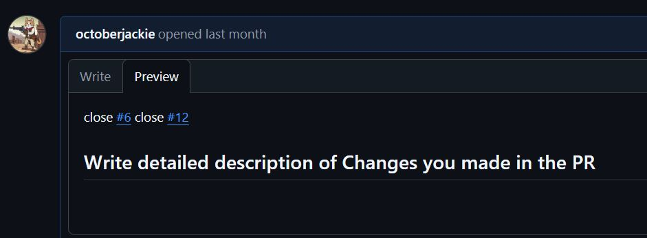

# Claiming Multiple Bounties: Multi-Bounty PRs

## Claiming Multiple Bounties: Multi-Bounty PRs

You can solve and claim multiple bounties in a single pull request by referencing several issues in your PR description (e.g., `close #6 close #12`).


## :warning: IMPORTANT :warning:

&#x20;You must click "_**Claim Reward**_" & "_**Check**_" on each individual issue on Lightning Bounties to receive each bounty reward.&#x20;

Claiming is done separately for every issue, even if they were closed together in one PR.



***

## How to Claim Multiple Bounties in One PR

1. **Solve multiple issues**
   * Make sure each issue you solve is still open bounty.
2.  **Create a single PR referencing all issues**

    * In your PR description, use the closing keywords for each issue you solved:

    <figure><figcaption>
A single PR can close multiple issues by listing each with<code>close #issue-number</code> 
</figcaption></figure>

    * This will close all referenced issues when the PR is merged.
3. **Wait for PR approval and merge**
   * Once the PR is merged, GitHub will close all referenced issues.
4. **Claim rewards individually**
   * Go to each issue’s page on Lightning Bounties.
   * Click '_**Claim Reward'**_ and _**'Check'**_ for each bounty you solved.
   * Each bounty reward will be processed separately.



<figure><figcaption>
You must claim each bounty individually, even if closed in one PR.
</figcaption></figure>

***

### Common Pitfalls & How to Avoid Them

* **Forgetting to use closing keywords:**\
  Always include `close #issue-number` for each issue in the PR description (not in comments or commits).
* **Not claiming each bounty:**\
  After your PR is merged, visit each issue on Lightning Bounties and click "Claim Reward" separately.
* **Trying to claim after missing a close keyword:**\
  If you forgot to link an issue, create a minimal follow-up PR for that issue, include the correct closing keyword, and reference the original PR.
* **Assuming rewards are automatic:**\
  Rewards are **not** sent automatically when the PR is merged. You must manually claim each one.

***

### Visual Workflow

<figure><figcaption>
Visual Workflow
</figcaption></figure>

***

### Best Practices & Troubleshooting

* **Always use closing keywords (`close #issue-number`) in the PR description, not in comments or commits.**
* **You must claim each bounty individually on Lightning Bounties, even if multiple issues were closed in one PR.**
* **If you accidentally missed a bounty, create a minimal follow-up PR to properly close and claim it.**
* **Refresh the PR page after editing links to see updates.**

***

For more details, see [Claim Reward Criteria & Troubleshooting Guide](https://docs.lightningbounties.com/docs/getting-started/solving-a-bounty/claim-reward-criteria-and-troubleshooting-guide) and [GitHub’s guide to linking pull requests to issues](https://docs.github.com/en/issues/tracking-your-work-with-issues/using-issues/linking-a-pull-request-to-an-issue).

For additional assistance, join the Lightning Bounties [Discord](https://discord.gg/zBxj4x4Cbq) community.
