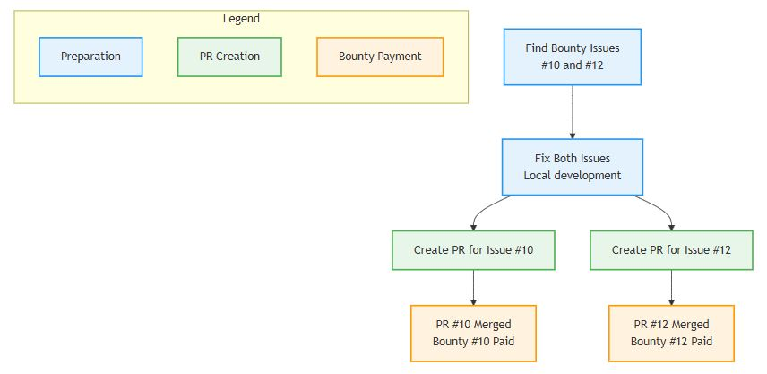
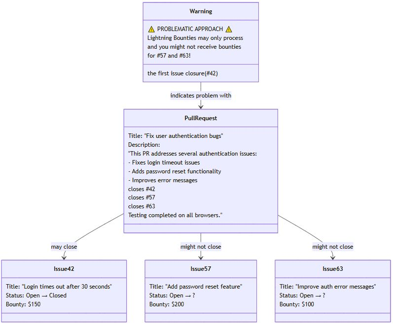

# Claiming Multiple Bounties: Multi-Bounty PRs

## Claiming Multiple Bounties: Multi-Bounty PRs

<figure><figcaption><p>The diagram above illustrates the recommended process for claiming multiple bounties with separate PRs.</p></figcaption></figure>

***

### What Are Multi-Bounty PRs?

**A multi-bounty situation** occurs when you solve multiple issues that each have their own bounty rewards.


**Important Rule:** You must claim each bounty separately.


This means:

* :x: Creating a single PR that mentions multiple bounty issues won't properly trigger all payments
* :white\_check\_mark: Lightning Bounties needs to see a clear one-to-one relationship between PRs and bounty issues
* :white\_check\_mark: Every bounty issue needs its own dedicated "close #issue-number" statement

Think of it like separate transactions - each bounty payment needs its own dedicated PR to process correctly.

***

### Why Is This So Important?

Lightning Bounties works with GitHub's automation system in a specific way:

1. When you add `close #issue-number` in a PR description, it signals the system to prepare a bounty payment
2. If you include multiple closure statements in one PR, **the system may only recognize the first one**
3. This means you could miss out on legitimate bounty payments for your work

[Learn more about GitHub's issue linking here](https://docs.github.com/en/issues/tracking-your-work-with-issues/linking-a-pull-request-to-an-issue)

## How To Claim Multiple Bounties (The Right Way)

### ✅ **RECOMMENDED: One PR Per Bounty Issue**

1. **Create a separate PR for each bounty issue you solve**
2. In each PR description, include `close #X`, where X is the issue number
3. Merge each PR after review

**This approach guarantees that each bounty is properly tracked and paid.**

### ⚠️ **IF YOU MUST: Combining Fixes in One PR (Not Recommended)**

If you've already combined multiple fixes in a single PR:

1. Merge that combined PR as usual
2.  For each additional bounty issue that wasn't properly claimed:

    * Create a minimal follow-up PR (e.g., update a comment or documentation)
    * Include `close #X` for the remaining issue in the PR description
    * Reference the original PR to explain the situation

    Example:

    ```
    close #42This PR references the work completed in #123 (original PR).
    ```
3. Merge each follow-up PR to trigger the remaining bounty payouts

[See GitHub's documentation on closing issues with keywords](https://docs.github.com/en/issues/tracking-your-work-with-issues/linking-a-pull-request-to-an-issue#linking-a-pull-request-to-an-issue-using-a-keyword)

### Why We Require Separate Claims

* Lightning Bounties tracks rewards based on individual PR-to-issue relationships
* The payment system processes each bounty claim independently
* When multiple closure statements appear in one PR, the system typically only processes the first one

***

### Example Workflow

| Step                     | Action                                                              |
| ------------------------ | ------------------------------------------------------------------- |
| 1. Solve multiple issues | Fix code for issues #10 and #12, each with a bounty.                |
| 2. Create PR for #10     | PR description: `close #10`                                         |
| 3. Create PR for #12     | PR description: `close #12`                                         |
| 4. Both PRs merged       | Each bounty is automatically recognized and paid out by the system. |

If you accidentally merged a PR that fixed multiple issues but only closed one bounty,\
create a new minimal PR for each remaining bounty, referencing the original PR as the source of the fix. [Learn more about PR editing limitations](https://docs.github.com/en/pull-requests/collaborating-with-pull-requests/proposing-changes-to-your-work-with-pull-requests/editing-a-pull-request)

***

### 🧠 Expert Tips

* Keeping PRs atomic (one per issue) helps with clarity, review, and automation. [See GitHub's PR best practices](https://docs.github.com/en/pull-requests/collaborating-with-pull-requests/proposing-changes-to-your-work-with-pull-requests/best-practices-for-pull-requests)
* If you're ever unsure, default to one PR per bounty issue.
* Always use the `close #issue-number` syntax in the PR description, not just in comments.
* After removing or adding an issue link from the PR body, refresh the page to see the changes reflected in the PR interface. The previously linked issue will no longer appear in the related issues section. [Learn more about issue-PR relationships here](https://docs.github.com/en/issues/tracking-your-work-with-issues/about-issues)

***

### Troubleshooting

:x: **Problem:** You've already merged a PR that fixed multiple issues but only claimed one bounty\
:white\_check\_mark: **Solution:** Create minimal follow-up PRs for each unclaimed bounty, referencing the original PR

:x: **Problem:** You're not sure if your PR will correctly trigger the bounty\
:white\_check\_mark: **Solution:** Check that you've used exactly `close #X`, `closes #X`, or `closed #X` in the PR description (not in comments)

:x: **Problem:** After editing a PR, you don't see changes to linked issues\
:white\_check\_mark: **Solution:** Refresh the page to see updated issue links in the PR interface

***

## What to Avoid

<figure><figcaption><p><em>This image shows a PR description attempting to close multiple bounty issues at once, which may result in missed rewards.</em></p></figcaption></figure>

As shown in the image above, including multiple `closes #issue-number` lines in a single PR description may cause issues with the Lightning Bounties system.&#x20;

Even though GitHub will close all the referenced issues, Lightning Bounties might only process the bounty for the first issue mentioned (`#42` in this example), leaving you without the rewards for `issues #57` and `#63`.

### Summary

* **Always claim each bounty separately.**
* **Use one PR per bounty issue whenever possible.**
* **If you combine fixes, follow up with minimal PRs to close and claim each remaining bounty.**
* **Use `close #issue-number` in each PR description to trigger the payout.**
* **Check** [**Lightning Bounties documentation**](https://docs.lightningbounties.com/docs/getting-started/solving-a-bounty) **for the latest guidelines and best practices.**
