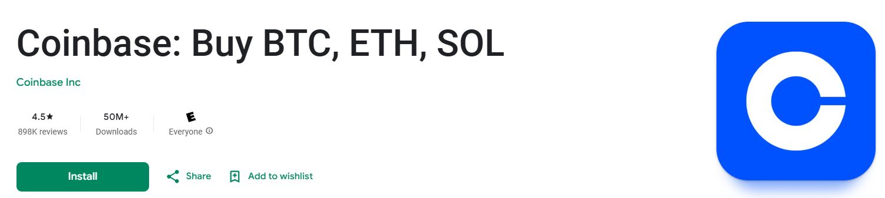

# 5/25-Detailed Example: Generating a Lightning Invoice with Coinbase

### Detailed Example: Generating a Lightning Invoice with Coinbase

For this tutorial, we'll use Coinbase as our example wallet since it offers convenient features for converting sats to local currencies.

#### 1. Set Up Your Coinbase Account (First-time Users)

If you haven't already, download and set up the Coinbase app:

1. Download Coinbase from your app store
2. Create and verify your account
3. Complete identity verification if required

<figure><figcaption></figcaption></figure>

#### 2. Open the Coinbase App

Open your Coinbase app and ensure you're signed in.

\[IMAGE: Coinbase app login screen]

#### 3. Navigate to Bitcoin Receiving Options

1. Tap on the Bitcoin (BTC) asset in your portfolio
2. Tap "Receive" button
3. Select "Bitcoin" from the available options

\[VIDEO: Short screen recording showing navigation to receive Bitcoin in Coinbase app]

#### 4. Select Lightning Network Option

On the receive screen, you'll see an option to receive via Lightning Network:

1. Tap on the "Lightning" tab or option
2. The app will display information about Lightning Network transfers

\[IMAGE: Screenshot showing where to select Lightning Network option in Coinbase]

#### 5. Generate Your Lightning Invoice

1. Enter the amount in sats you wish to withdraw from Lightning Bounties
2. Tap "Generate invoice" or similar button
3. The app will generate a Lightning invoice (a long string starting with "lnbc")

\[IMAGE: Screenshot showing the Lightning invoice generation screen with amount input field]

#### 6. Copy Your Lightning Invoice

1. Tap the "Copy" button next to the generated Lightning invoice
2. The invoice is now copied to your clipboard and ready to use

\[IMAGE: Close-up of the copy button next to a generated Lightning invoice]

#### 7. Return to Lightning Bounties for Withdrawal

1. Return to the Lightning Bounties withdrawal page
2. Paste the copied Coinbase invoice into the withdrawal input field
3. Click on "Withdraw" to complete the transaction

\[IMAGE: Split-screen showing Coinbase invoice and Lightning Bounties withdrawal page]

### Converting to Local Currency

After receiving sats in Coinbase:

1. Navigate to your Bitcoin balance
2. Tap "Convert" or "Trade"
3. Select your local currency as the destination
4. Enter the amount and confirm



### Important Notes

* **No minimum withdrawal**: Lightning Bounties doesn't enforce a minimum withdrawal amount
* **Fee recommendation**: Keep approximately 2% of your withdrawal amount in your account to cover Lightning Network routing fees
* **Processing time**: Most withdrawals are processed instantly, but may occasionally take up to 5 minutes during high network activity
* **Invoice expiration**: Lightning invoices typically expire after a set period (usually 60 minutes to 24 hours, depending on your wallet)

\[IMAGE: Informational card highlighting the important notes with icons]

### Troubleshooting

#### Common Issues and Solutions

| Issue                                          | Solution                                                                                                |
| ---------------------------------------------- | ------------------------------------------------------------------------------------------------------- |
| "Invalid invoice" error                        | Check that you've copied the entire invoice string correctly and that it hasn't expired                 |
| Payment shows as "initiated but not confirmed" | The Lightning Network might be experiencing congestion - wait a few minutes and check your wallet       |
| Routing failures                               | Lightning Network routing issues can occur - try generating a new invoice or try again in a few minutes |
| Transaction fees too high                      | Keep approximately 2% of your total amount in your account to cover routing fees                        |

\[IMAGE: Screenshot showing an error message with solution highlighted]

#### Lightning Network Transaction Problems

Two common reasons for Lightning payment failures are:

1. **Insufficient funds for fees**: Although Lightning Bounties doesn't require a minimum balance, the Lightning Network itself requires enough funds to cover routing fees
2. **Routing issues**: Sometimes the network cannot find a suitable path to your node - simply try again after a few minutes

\[IMAGE: Diagram illustrating Lightning Network routing and potential failure points]

#### Coinbase-Specific Troubleshooting

If you encounter issues with Coinbase Lightning invoices:

* Ensure you're using the latest version of the Coinbase app
* Check that you have a stable internet connection
* Verify the invoice hasn't expired (generate a new one if needed)
* Contact Coinbase support if Lightning Network features aren't available in your region

\[IMAGE: Coinbase help and support screen]

### Frequently Asked Questions

How do I receive payments?

Once you solve a bounty and your pull request is accepted:

* Visit **app.lightningbounties.com** and find the bounty you solved
* Click the "**Claim Reward**" button
* Click the "**Check**" button to verify your eligibility
* Payments are sent _instantly_ to your Lightning Bounties account

> _"Lightning-fast payments for your open-source contributions-no banking restrictions, no delays!"_

Do I need to pay fees to use Lightning Bounties?

Lightning Bounties doesn't charge any platform fees for withdrawals. However, the Lightning Network itself has minimal routing fees which vary based on network conditions. We recommend keeping approximately 2% of your withdrawal amount in your account to cover these fees.

Why did my withdrawal fail?

The most common reasons for withdrawal failures are:

1. **Invoice expired** - Lightning invoices are typically valid for 60 minutes to 24 hours
2. **Routing issues** - The Lightning Network couldn't find a path to your node
3. **Insufficient funds for fees** - You need enough additional sats to cover network routing fees

Try generating a fresh invoice and attempting the withdrawal again. If problems persist, join our [Discord community](https://discord.gg/zBxj4x4Cbq) for help.

Can I withdraw to a Bitcoin on-chain address?

Currently, Lightning Bounties only supports withdrawals via the Lightning Network. To convert your sats to on-chain Bitcoin, you can withdraw to an exchange like Coinbase that supports both Lightning and on-chain transactions.

Is there a way to see the USD value of my sats?

Yes! Click on your sats balance display to toggle between satoshi and USD value formats.

***

**Need more help?** Join our [Discord community](https://discord.gg/zBxj4x4Cbq) for assistance with withdrawals or any other Lightning Bounties features.
